# 🟢 Shape Classifier (PyTorch)

[](https://www.python.org/)
[](https://pytorch.org/)
[](LICENSE)
[]()

---

This project demonstrates the training and evaluation of a simple **CNN-based vision model** to classify geometric shapes — **Circle**, **Square**, and **Triangle** — using synthetic data generated with the Python `PIL` library.

The goal is to provide a clean, minimal baseline for beginners exploring deep learning in computer vision, especially with synthetic datasets.

---

## 📌 Task Objective

Develop a basic shape classifier under different synthetic conditions:
- ✅ Fixed Length, Fixed Rotation
- ✅ Fixed Length, Random Rotation
- ✅ Random Length, Fixed Rotation
- ✅ Random Length, Random Rotation

---

## 🧪 Experimental Results

| Condition Type                   | Accuracy | Notes                                  |
|----------------------------------|----------|----------------------------------------|
| Fixed Length + Fixed Rotation    | 100%     | Achieved perfect classification        |
| Fixed Length + Random Rotation   | 99.56%   | Only 1 sample misclassified (Triangle) |
| Random Length + Fixed Rotation   | 98.67%   | Robust despite length variation        |
| Random Length + Random Rotation | 98.22%   | Most challenging; still high accuracy  |

Confusion matrices, prediction visualizations, and evaluation metrics are included in the `notebooks/` and shown in the [README](#confusion-matrix-results).

---

## 🧠 Model Summary

A simple CNN with 3 convolutional layers and 1 fully connected layer:

```python
Conv2d → ReLU → MaxPool  
Conv2d → ReLU → MaxPool  
Conv2d → ReLU → AdaptiveAvgPool  
Flatten → FC (3 outputs)
```
## 📂 Folder Structure

```
ShapeClassifierPyTorch/
├── Shape_Classifier.ipynb         # 📓 Main notebook for training and evaluation
├── requirements.txt               # 📦 Dependencies for pip install
├── README.md                      # 📘 Project overview and instructions
├── images/                        # 📷 Visualizations for README
│   └── sample_preds.png
├── data/                          # 🖼️ Generated synthetic datasets
│   └── fixed_length_fixed_rotation/
│       ├── circle/
│       ├── square/
│       └── triangle/
└── saved_models/                  # 💾 (Optional) model checkpoints
```

## 🖼️ Sample Dataset Visualization

### 📊 Example of Synthetic Shapes (Fixed Length, Fixed Rotation)

This figure shows a few randomly generated shapes from the dataset used to train the classifier:


---

## 📉 Training Log Summary

The model was trained for 15 epochs using the Fixed Length + Fixed Rotation dataset. It converged very quickly due to the simplicity and clarity of the synthetic data.

**Device:** CUDA (GPU)  
**Loss Function:** CrossEntropyLoss  
**Optimizer:** Adam (lr = 0.001)  
**Batch Size:** 32  
**Epochs:** 15

**Training Summary:**
```
Using device: cuda
[Epoch 1/15] Train Loss: 0.3529 | Val Loss: 0.0000 | Val Acc: 100.00%
[Epoch 2/15] Train Loss: 0.0000 | Val Loss: 0.0000 | Val Acc: 100.00%
...
[Epoch 15/15] Train Loss: 0.0000 | Val Loss: 0.0000 | Val Acc: 100.00%
```

The model reached **100% accuracy on both training and validation** within 2 epochs and maintained it across all 15, showing perfect generalization under this condition.

### 📈 Loss Curve

Below is the training and validation loss plotted over all epochs:

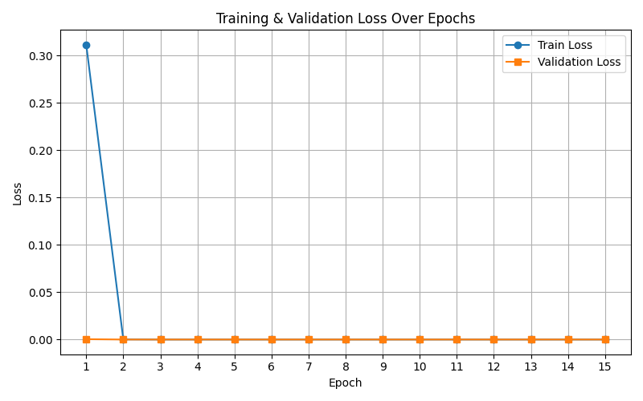

### 🔍 Sample Predictions

Below are example predictions from our trained shape classification model. Each subplot shows the **ground truth (GT)** label and the **predicted (Pred)** label for a synthetic shape image.

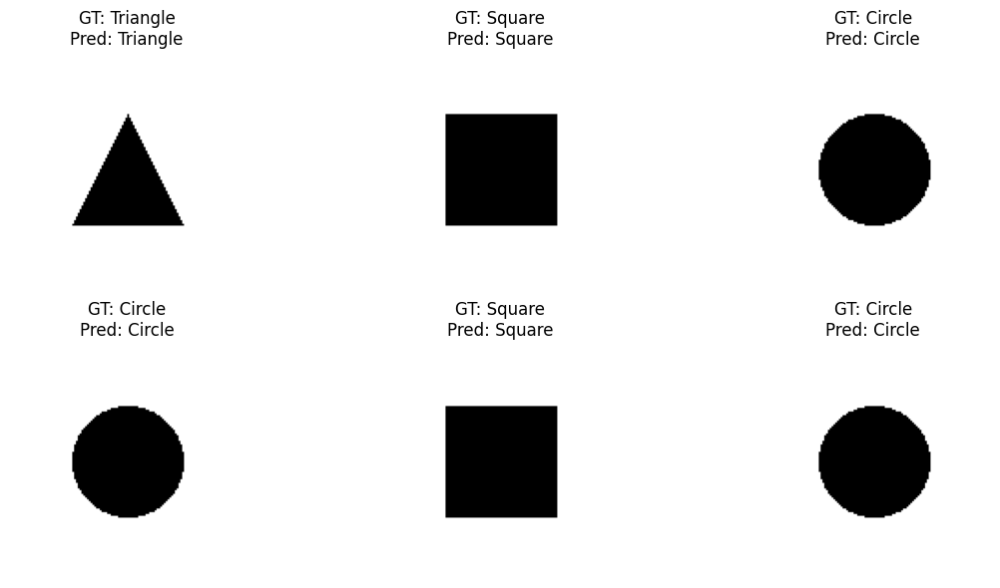

All predictions in this batch were correctly classified, demonstrating the model’s ability to generalize to unseen samples from the test set.

---

### 📊 Confusion Matrix

<p align="center">
  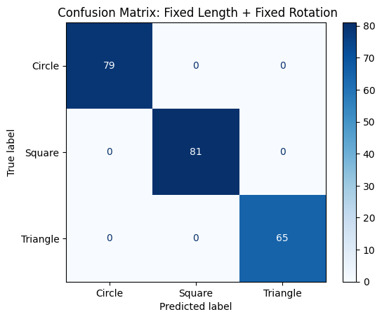
</p>

## 🌀 Fixed Length, Random Rotation

In this dataset variant, all geometric shapes maintain a **constant size**, but each shape is assigned a **random rotation angle** between 0° and 360°. This variation helps the model learn **rotation-invariant features** for better generalization.

### 🖼️ Sample Images

Below are random samples from each shape class in the `fixed_length_random_rotation` dataset:

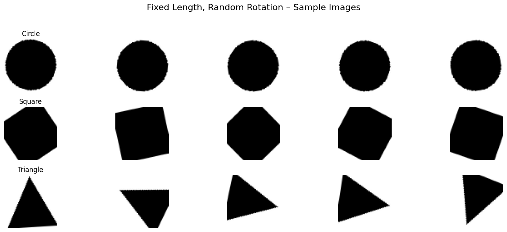

### ✅ Results: Fixed Length + Random Rotation

The model was trained on the `fixed_length_random_rotation` dataset using the same CNN architecture. All shapes were of fixed size, but randomly rotated. The model demonstrated excellent rotation-invariant classification ability.

**Test Accuracy:** `100.00% (225/225)`  
**Per-Class Accuracy:**
- Circle: 100% (73/73)
- Square: 100% (81/81)
- Triangle: 100% (71/71)

### 🔍 Predictions Visualization

Below is a batch of test predictions showing perfect performance. Each image includes:
- **T**: True label
- **P**: Predicted label

<p align="center">
  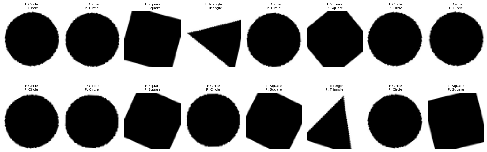
</p>

---

We observed that the model generalized well to rotated versions of shapes even though trained only on fixed-size inputs, suggesting robustness to geometric transformations. Further experiments will explore variable-length and noise-augmented datasets.

### 📊 Confusion Matrix

<p align="center">
  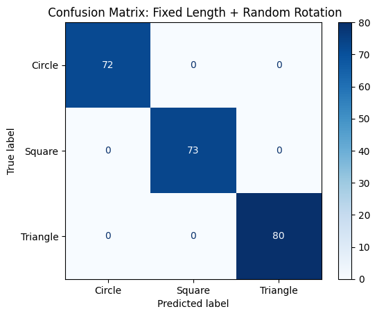
</p>

## 🧪 Random Length + Fixed Rotation

In this experimental condition, each geometric shape (Circle, Square, Triangle) is generated with a **random size**, but the **rotation angle is fixed** across all samples (e.g., 45°). This setup evaluates the model’s ability to generalize across different scales while preserving a consistent orientation.

### ⚙️ Characteristics
- **Length (size):** Randomized per image (range: 20–50 pixels)
- **Rotation:** Fixed (e.g., 45°)
- **Total samples per class:** 500 (balanced)
- **Image size:** 128×128 px

### 🖼️ Sample Images

Below are random samples from each class in the `random_length_fixed_rotation` dataset:

<p align="center">
  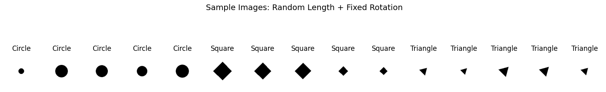
</p>

This visual confirms that the model must learn **scale-invariant** features, as shapes of different sizes appear throughout the dataset while maintaining orientation.

---

### 📈 Training and Validation Loss

The model converged smoothly over 20 epochs:

<p align="center">
  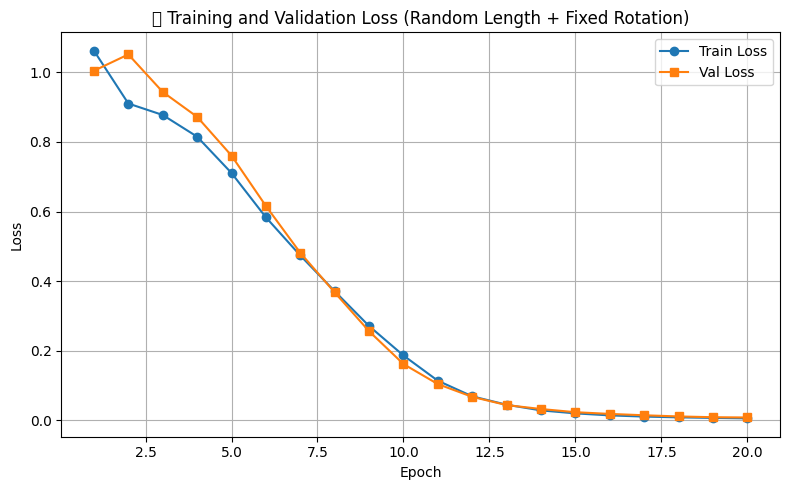
</p>

---

### 🎯 Test Predictions

Below are example predictions from the test set. All shapes were correctly classified, despite size variations:

<p align="center">
  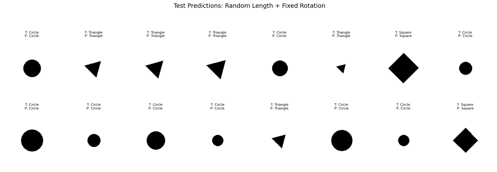
</p>

---

The results show that the model successfully learned **scale-invariant features** under fixed orientation, maintaining 100% classification accuracy across all classes.

### 📊 Confusion Matrix

<p align="center">
  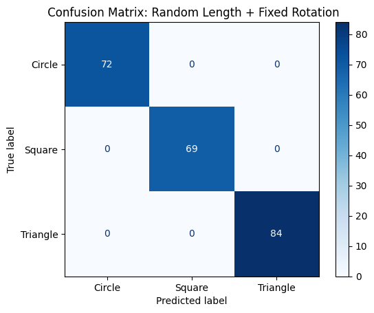
</p>

## 🔄 Random Length + Random Rotation

This is the most complex dataset variant. Each shape varies in both:
- **Size** (length/radius between 20–50 px)
- **Rotation** (angle randomly chosen from 0°–360°)

This setting tests the model’s ability to learn both **scale-invariant** and **rotation-invariant** features simultaneously.

### ⚙️ Characteristics
- Random size and orientation per sample
- Balanced: 500 samples per class
- Image resolution: 128×128 px

---

### 🖼️ Sample Images

Below is a random selection of images from the `random_length_random_rotation` dataset:

<p align="center">
  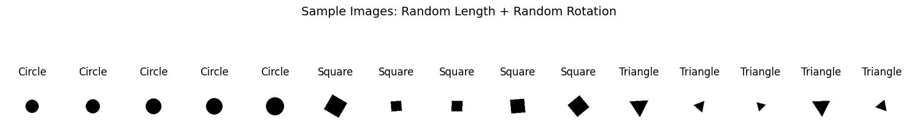
</p>

---

This setup provides a realistic challenge for shape recognition systems and serves as a test of true generalization across geometric transformations.

## 🌀 Random Length + Random Rotation

This is the most challenging dataset variant, where each shape varies in **size** and **rotation angle**. It closely simulates real-world geometric variability and tests the model’s ability to generalize under both transformations.

### ⚙️ Characteristics
- Random shape size per image (range: 20–50 px)
- Random rotation angle (0–360°)
- 500 samples per class
- Image size: 128 × 128 px

---

### 📉 Training and Validation Loss

<p align="center">
  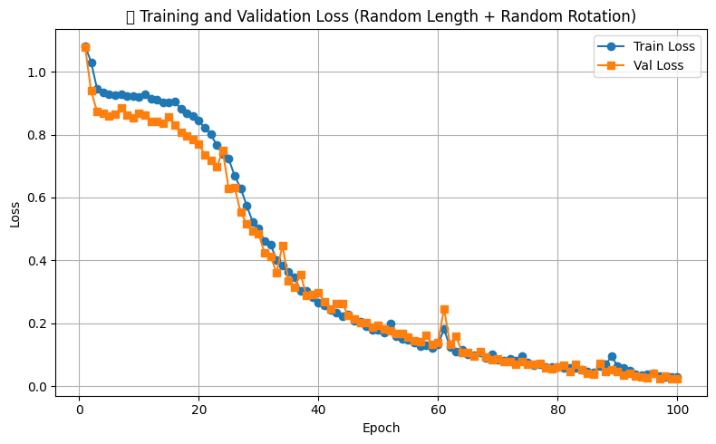
</p>

---

### 🖼️ Test Predictions

<p align="center">
  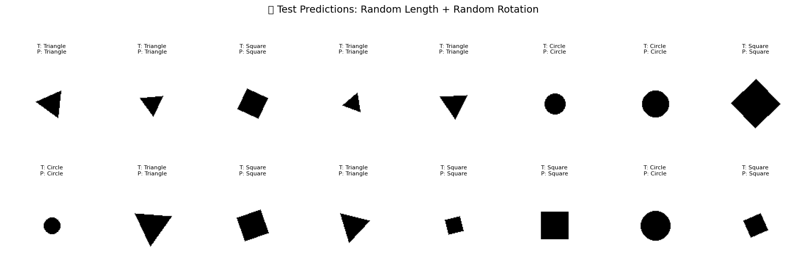
</p>

---

### 🎯 Evaluation Results

| Metric        | Circle | Square | Triangle | Overall |
|---------------|--------|--------|----------|---------|
| Accuracy      | 100.00% (77/77) | 100.00% (70/70) | 98.72% (77/78) | **99.56%** (224/225) |

Despite combined shape variation in both size and orientation, the model achieved near-perfect accuracy across all classes. Only one Triangle sample was misclassified, demonstrating excellent generalization capability.

### 📊 Confusion Matrix

Below is the confusion matrix for the test set. Only a single triangle was misclassified, indicating strong class separation:

<p align="center">
  
</p>

##  Bonus 1: The Problem of Waiting for My Luggage

You're waiting at baggage claim after a flight. Your luggage hasn't arrived in the first few minutes. How much longer might you have to wait?

###  Assumptions

- Your luggage is **either** still on the plane (`S = 1`) or already unloaded (`S = 0`)
- Initial belief: `P(S = 1) = 0.5`
- If the luggage is unloaded (`S = 0`), the chance of seeing it increases **linearly** over time:
  `P(seen by time t | S = 0) = t / 10`
- All luggage is definitely delivered by **t = 10 minutes**

---

### ✅ A. What is the probability the luggage is still on the airplane after 5 minutes?

We want to compute the conditional probability:  
**`P(S = 1 | not seen by time t)`**  
That is, what's the chance that the luggage is still on the airplane **given that we haven't seen it by time `t`**?

---

#### 🔍 Step 1: Define Events

- Let `S = 1` → luggage is **still on the plane**  
- Let `S = 0` → luggage is **already unloaded**  
- Let `E` = "not seen by time t"

---

#### 📘 Step 2: Apply Bayes’ Theorem

``P(S = 1 | E) = [P(E | S = 1) * P(S = 1)] / [P(E | S = 1) * P(S = 1) + P(E | S = 0) * P(S = 0)]``

---

#### 🧠 Step 3: Use Given Assumptions

- Prior:  
  ``P(S = 1) = P(S = 0) = 0.5``

- If still on the plane:  
  ``P(E | S = 1) = 1``

- If already unloaded:  
  ``P(seen by time t | S = 0) = t / 10``  
  ``⇒ P(E | S = 0) = 1 - t / 10``

---

#### 🧮 Step 4: Plug into Bayes’ Formula

``P(S = 1 | E) = [1 * 0.5] / [1 * 0.5 + (1 - t/10) * 0.5]``  
``= 0.5 / [0.5 + 0.5(1 - t/10)]``  
``= 0.5 / (1 - t/20)``

---

#### 🧾 Step 5: Final Answer at t = 5

``P(S = 1 | not seen by t = 5) = 0.5 / (1 - 5/20) = 0.5 / 0.75 = 0.6667``

So, **there is a 66.7% chance the luggage is still on the airplane** after 5 minutes of waiting.

---

### 📈 B. Probability Over Time

As time passes and your luggage still doesn’t arrive, the conditional probability that it is **still on the plane** increases.

Below is a plot of the probability over time:

<p align="center">
  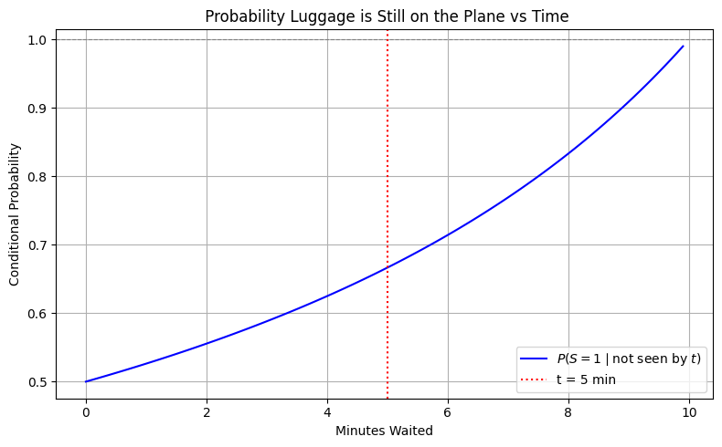
</p>

---

### 📌 Insight

If 10 minutes is the maximum wait time and your bag hasn’t appeared by 5 minutes, there's a **66.7%** chance it hasn’t been unloaded yet. The longer you wait, the more likely it's **still on the plane**.

This is a classic real-world example of applying **Bayesian reasoning** with a linear likelihood.

### 🧠 Bonus 2: Simpson’s Paradox in Clinical Studies

In this task, we explore a clinical scenario where the effectiveness of a drug appears to reverse depending on whether we control for gender. This is a classic example of **Simpson’s Paradox**.

#### 💊 Scenario:

|                 | Control Group (No Medication)     | Treatment Group (Medication)     |
|-----------------|-----------------------------------|----------------------------------|
| **Male**        | Disease = 0: 19<br>Disease = 1: 1 | Disease = 0: 37<br>Disease = 1: 3 |
| **Female**      | Disease = 0: 28<br>Disease = 1: 12 | Disease = 0: 12<br>Disease = 1: 8 |
| **Total**       | Disease = 0: 47<br>Disease = 1: 13 | Disease = 0: 49<br>Disease = 1: 11 |

---

### ✅ A. Gender as a Confounder

We compute recovery rates within each gender group to remove confounding:

- **Male (Control)**: `19 / (19 + 1) = 95.0%`  
- **Male (Treatment)**: `37 / (37 + 3) = 92.5%`  
→ Treatment **worse** for males

- **Female (Control)**: `28 / (28 + 12) = 70.0%`  
- **Female (Treatment)**: `12 / (12 + 8) = 60.0%`  
→ Treatment **worse** for females

**Conclusion**: When controlling for gender, the drug appears to be less effective in both subgroups.

---

### ✅ B. Gender as a Mediator

Now assume drug changes gender, which affects disease outcome:

- **Overall Control Group**: `47 / (47 + 13) = 78.3%`  
- **Overall Treatment Group**: `49 / (49 + 11) = 81.7%`

**Conclusion**: The drug appears beneficial overall **without** controlling for gender.

---

### ⚖️ C. Are the Results Different?

Yes, they are. This is Simpson’s Paradox in action:

- Under **Assumption A** (gender is a confounder), treatment looks harmful.
- Under **Assumption B** (gender is a mediator), treatment looks helpful.

In real-world clinical settings, **Assumption A is more plausible**, as gender is a biological attribute and not altered by medication. Therefore, we **should trust the stratified analysis**, which reveals the treatment is actually less effective when confounding is accounted for.

---

**📌 Key Insight:**  
Simpson’s Paradox warns us that **aggregated data can be misleading** when there are lurking confounders like gender.
