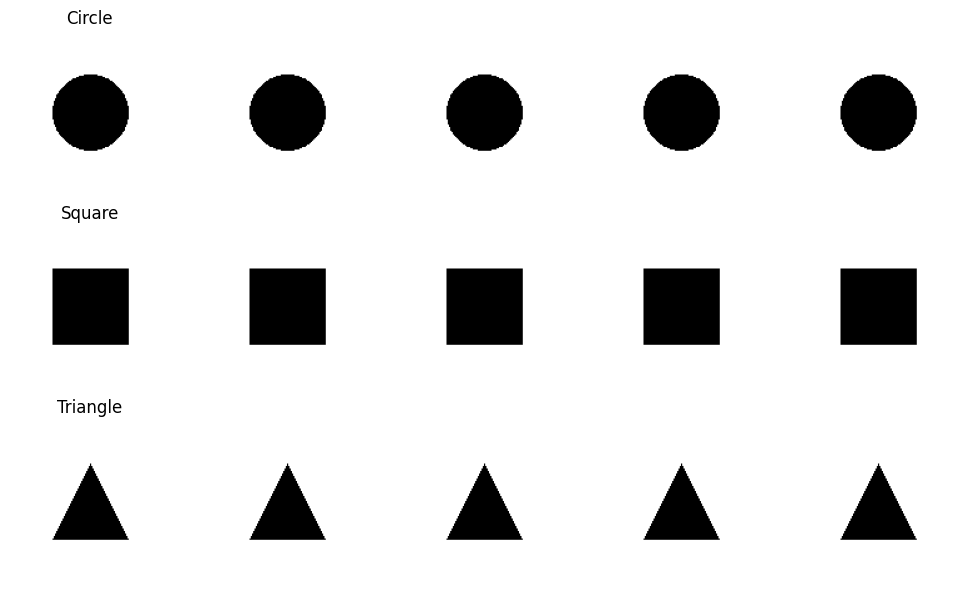

# 🟢 Shape Classifier (PyTorch)

[](https://www.python.org/)
[](https://pytorch.org/)
[](LICENSE)
[]()

---

This project demonstrates the training and evaluation of a simple **CNN-based vision model** to classify geometric shapes — **Circle**, **Square**, and **Triangle** — using synthetic data generated with the Python `PIL` library.

The goal is to provide a clean, minimal baseline for beginners exploring deep learning in computer vision, especially with synthetic datasets.

---

## 📌 Task Objective

Develop a basic shape classifier under different synthetic conditions:
- Fixed Length, Fixed Rotation ✅
- Fixed Length, Random Rotation ⏳
- Random Length, Fixed Rotation ⏳
- Random Length, Random Rotation ⏳

---

## 🧪 Current Status
| Condition Type | Implemented | Accuracy |
|----------------|-------------|----------|
| Fixed Length + Fixed Rotation | ✅ Done | 100% (Train / Val / Test) |

---

## 🧠 Model Summary

A simple CNN with 3 convolutional layers and 2 fully connected layers is used. It efficiently classifies synthetic shapes under the fixed size + rotation condition with 100% accuracy.

```python
Conv2d → ReLU → MaxPool  
Conv2d → ReLU → MaxPool  
Conv2d → ReLU → MaxPool  
Flatten → FC → ReLU → FC (3 outputs)
```
---

## 📂 Folder Structure

```
ShapeClassifierPyTorch/
├── Shape_Classifier.ipynb         # 📓 Main notebook for training and evaluation
├── requirements.txt               # 📦 Dependencies for pip install
├── README.md                      # 📘 Project overview and instructions
├── images/                        # 📷 Visualizations for README
│   └── sample_preds.png
├── data/                          # 🖼️ Generated synthetic datasets
│   └── fixed_length_fixed_rotation/
│       ├── circle/
│       ├── square/
│       └── triangle/
└── saved_models/                  # 💾 (Optional) model checkpoints
```

## 🖼️ Sample Dataset Visualization

### 📊 Example of Synthetic Shapes (Fixed Length, Fixed Rotation)

This figure shows a few randomly generated shapes from the dataset used to train the classifier:



---

## 📉 Training Log Summary

The model was trained for 15 epochs using the Fixed Length + Fixed Rotation dataset. It converged very quickly due to the simplicity and clarity of the synthetic data.

**Device:** CUDA (GPU)  
**Loss Function:** CrossEntropyLoss  
**Optimizer:** Adam (lr = 0.001)  
**Batch Size:** 32  
**Epochs:** 15

**Training Summary:**
```
Using device: cuda
[Epoch 1/15] Train Loss: 0.3529 | Val Loss: 0.0000 | Val Acc: 100.00%
[Epoch 2/15] Train Loss: 0.0000 | Val Loss: 0.0000 | Val Acc: 100.00%
...
[Epoch 15/15] Train Loss: 0.0000 | Val Loss: 0.0000 | Val Acc: 100.00%
```

The model reached **100% accuracy on both training and validation** within 2 epochs and maintained it across all 15, showing perfect generalization under this condition.

### 📈 Loss Curve

Below is the training and validation loss plotted over all epochs:


### 🔍 Sample Predictions

Below are example predictions from our trained shape classification model. Each subplot shows the **ground truth (GT)** label and the **predicted (Pred)** label for a synthetic shape image.


All predictions in this batch were correctly classified, demonstrating the model’s ability to generalize to unseen samples from the test set.

---

## 🌀 Fixed Length, Random Rotation

In this dataset variant, all geometric shapes maintain a **constant size**, but each shape is assigned a **random rotation angle** between 0° and 360°. This variation helps the model learn **rotation-invariant features** for better generalization.

### 🖼️ Sample Images

Below are random samples from each shape class in the `fixed_length_random_rotation` dataset:


### ✅ Results: Fixed Length + Random Rotation

The model was trained on the `fixed_length_random_rotation` dataset using the same CNN architecture. All shapes were of fixed size, but randomly rotated. The model demonstrated excellent rotation-invariant classification ability.

**Test Accuracy:** `100.00% (225/225)`  
**Per-Class Accuracy:**
- Circle: 100% (73/73)
- Square: 100% (81/81)
- Triangle: 100% (71/71)

### 🔍 Predictions Visualization

Below is a batch of test predictions showing perfect performance. Each image includes:
- **T**: True label
- **P**: Predicted label

<p align="center">
  
</p>

---

We observed that the model generalized well to rotated versions of shapes even though trained only on fixed-size inputs, suggesting robustness to geometric transformations. Further experiments will explore variable-length and noise-augmented datasets.

## 🧪 Random Length + Fixed Rotation

In this experimental condition, each geometric shape (Circle, Square, Triangle) is generated with a **random size**, but the **rotation angle is fixed** across all samples (e.g., 45°). This setup evaluates the model’s ability to generalize across different scales while preserving a consistent orientation.

### ⚙️ Characteristics
- **Length (size):** Randomized per image (range: 20–50 pixels)
- **Rotation:** Fixed (e.g., 45°)
- **Total samples per class:** 500 (balanced)
- **Image size:** 128×128 px

### 🖼️ Sample Images

Below are random samples from each class in the `random_length_fixed_rotation` dataset:

<p align="center">
  
</p>

This visual confirms that the model must learn **scale-invariant** features, as shapes of different sizes appear throughout the dataset while maintaining orientation.

---
